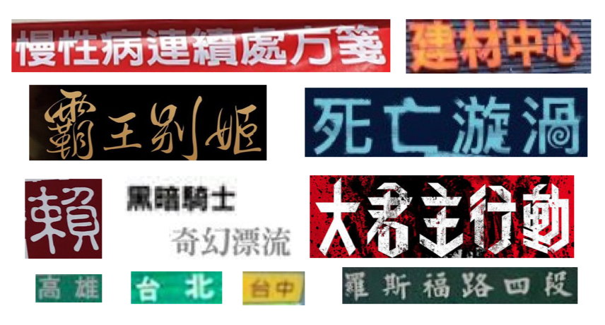

# Traditional Chinese Text Recognition Dataset: Synthetic Dataset and Labeled Data

Authors: [Yi-Chang Chen](https://github.com/GitYCC), Yu-Chuan Chang, Yen-Cheng Chang and Yi-Ren Yeh

Paper: 

Scene text recognition (STR) has been widely studied in academia and industry. Training a text recognition model often requires a large amount of labeled data, but data labeling can be difficult, expensive, or time-consuming, especially for Traditional Chinese text recognition. To the best of our knowledge, public datasets for Traditional Chinese text recognition are lacking. 

We generated over 20 million synthetic data and collected over 7,000 manually labeled data *TC-STR 7k-word* as the benchmark. Experimental results show that a text recognition model can achieve much better accuracy either by training from scratch with our generated synthetic data or by further fine-tuning with *TC-STR 7k-word*.

## Synthetic Dataset: TCSynth


## Labeled Data: TC-STR 7k-word

Our *TC-STR 7k-word* dataset collects about 1,554 images from Google image search to produce 7,543 cropped text images. To increase the diversity in our collected scene text images, we search for images under different scenarios and query keywords. Since the collected scene text images are to be used in evaluating text recognition performance, we manually crop text from the collected images and assign a label to each cropped text box. 

*TC-STR 7k-word* dataset includes a training set of 3,837 text images and a testing set of 3,706 images.

Download: [TC-STR.tar.gz](https://storage.googleapis.com/esun-ai/TC-STR.tar.gz)

```
TC-STR/
├── train_labels.txt
├── test_labels.txt
└── images/
    ├── xxx_1.jpg
    ├── xxx_2.jpg
    ├── xxx_3.jpg
    └── ...
```

format of xxx_labels.txt: `{imagepath}\t{label}\n`, for example:

```
images/billboard_00000_010_雜貨鋪.jpg 雜貨鋪
images/sign_02616_999_民生路.png 民生路
...
```



## Citation

Please consider citing this work in your publications if it helps your research.
```
```
